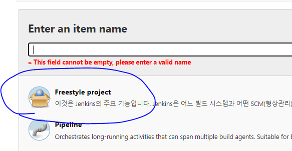
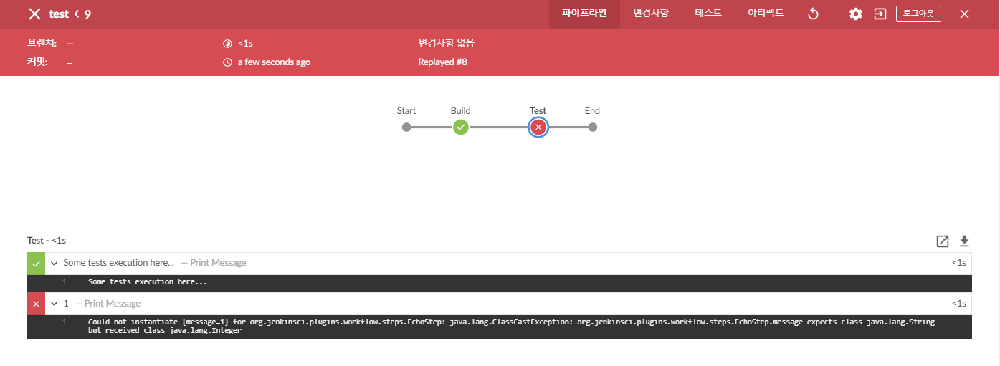
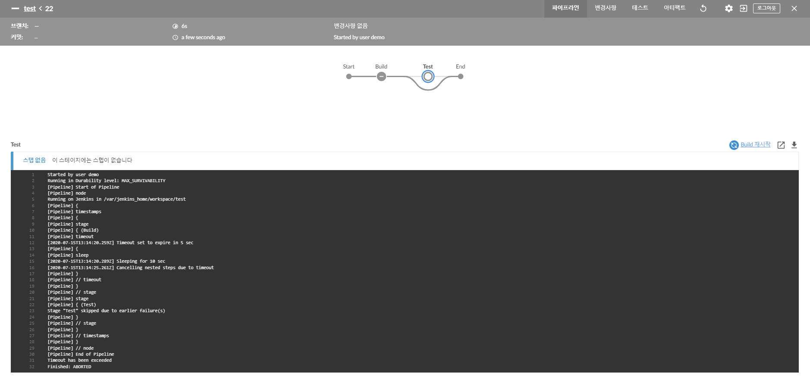
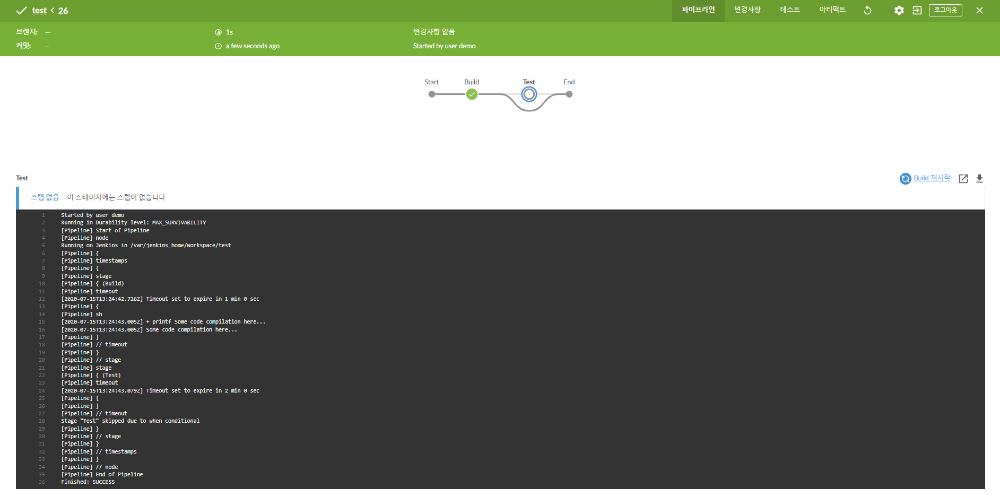

# 3장

# 새로운 젠킨스

## 젠킨스 설정 마법사 (이전 장에서 다 했던거라 넘어가겠음)

### 젠킨스 커스터마이징
- 젠킨스 플러그인 설정을 사용자가 설정할 수 있다.

## 새로운 젠킨스 파이프라인 잡

### 기존 젠킨스 프리스타일 잡
 - 웹 기반 GUI로 동작하는 설정 방식
 
 - 프리스타일 JOB을 여러개 만들어 파이프라인을 만들었음
 - 파이프라인 변경이 생기면 각각의 프리스타일 job 의 설정을 변경 해서 만들어야 했음  

### Pipline as Code
 - 프로그래밍이 가능하다.
 - 이전 여러개 JOB을 만들어 파이프라인을 만드는 것이 아닌 하나의 파일을 이용해 표현 가능
 - 버전 관리 가능!!!

### 실습


## 서술적(X) 스크립트(O) 파이프라인 문법 (단어가 틀렸음 )
- Groovy 구조를 가진 DSL(도메인 특화 언어) 이다.
 
### 기본 구조
- 노드 블럭
    - 스테이지 블록, 디렉티브, 스템이 실행될 젠킨스 에이전트를 정의한다.
    > 젠킨스 에이전트 : Master에서 구성하는 시스템(서버) 입니다.
    - 정의 : 스테이지, 디렉티브, 스텝이 실행될 노드
    - 구성 : 여러 개의 스테이지 블록, 디렉티브 또는 스텝 
    - 필수 여부 : 필수
    - 파라미터 : any, 레이블

- 스테이지 블럭
    - 스텝과 디렉티브의 모음
    - 정의 : 스텝과 디렉티브 모음
    - 구성 : 여러개의 노드 블록, 디렉티브 또는 스텝
    - 필수 여부 : 필수
    - 파라미터 : 스테이지의 이름(필수)

- 디렉티브
    - 환경변수, 옵션, 파라미터, 트리거, 툴 을 제공해 노드 블록과 스테이지 블록, 스텝을 지원하는 것
    - 정의 : 스테이지가 실행될 노드
    - 구성 : 환경 변수, 옵션, 파라미터, 트리거, 툴
    - 필수 여부 : 필수 아님, 하지만 대부분 가짐
    - 파라미터 없음

- 스텝
    - 실행 가능한 커맨드
    - 정의 : 무엇을 할지에 대한 커맨드
    - 구성 : 명령어, 스크립트
    - 필수 여부 : 디렉티브와 동일
    - 파라미터 : 없음

## 젠킨스 파이프라인 문법 도구
### 실습

## 멀티브랜치 파이프라인
- 사용자가 소스코드 저장소의 모든 브랜치에 대해 파이프라인을 자동으로 생성하게 해줌
- 버전관리 저장소에 Jenkinsfile을 통해 파이프라인을 설정
### 실습

## 젠킨스 블루오션
- 향상된 시각화
- 파이프라인 에디터
- 개인화 
- 쉽고 빠른 파이프라인 설정 마법사
### 실습
<br><br><br><br><br><br><br><br>

# 부록
## 선언적 파이프라인과 스크립트 파이프라인

### 1. 시작시 파이프라인 코드 유효성 검사

```
// 선언적 파이프라인
pipeline {
    agent any

    stages {
        stage("Build") {
            steps {
                echo "Some code compilation here..."
            }
        }

        stage("Test") {
            steps {
                echo "Some tests execution here..."
                echo 1
            }
        }
    }
}
```
- [실행결과]
 
<br><br><br><br>

```
// 스크립트 파이프라인
node {
    stage("Build") {
        echo "Some code compilation here..."
    }

    stage("Test") {
        echo "Some tests execution here..."
        echo 1
    }
}
```
- [실행결과]
 


- 차이점
    - 스크립트 파이프 라인은 초기 파이프 라인 코드에 대한 초기 유효성 검사가 없음
<br><br><br><br>

### 2. 원하는 stage에서 다시 시작 가능

```
// 선언적 파이프라인
pipeline {
    agent any

    stages {
        stage("Build") {
            steps {
                echo "Some code compilation here..."
            }
        }

        stage("Test") {
            steps {
                echo "Some tests execution here..."
            }
        }
    }
}
```
- [실행 결과]
 

 - 최초 실행시 마지막 stage인 test에 머물게 됨
 - 화면에 보이는 test 재시작이라는 버튼을 누르게 되면

 - [실행 결과]
  

  - 특정 stage 만 따로 시작할 수 있음
  <br><br><br><br>

  ```
// 스크립트 파이프라인
node {
    stage("Build") {
        echo "Some code compilation here..."
    }

    stage("Test") {
        echo "Some tests execution here..."
    }
}
```

 - [실행 결과]
 
 
 - 원하는 단계에서 따로 실행이 불가능
<br><br><br><br>
 ### 3. 선언적 파이프라인의 options 블럭

 - 파이프라인에 추가할 사항
    1. 콘솔 로그에 타임스탬프
    2. 각 스텔이지별 타임 out 설정
```
// 선언적 파이프라인
pipeline {
    agent any

    options {
        timestamps()
    }

    stages {
        stage("Build") {
            options {
                timeout(time: 5, unit: "SECONDS")
            }
            steps {
                sleep 10
                sh 'printf "Some code compilation here..."'
            }
        }

        stage("Test") {
            options {
                timeout(time: 2, unit: "MINUTES")
            }
            steps {
                sh 'printf "Some tests execution here..."'
            }
        }
    }
}
```

 - [실행 결과]
  
<br><br><br><br>
  ```
// 스크립트 파이프라인
node {
    timestamps {
        stage("Build") {
            timeout(time: 5, unit: "SECONDS") {
                sh 'printf "Some code compilation here..."'
            }
        }
        stage("Test") {
            timeout(time: 2, unit: "SECONDS") {
                sh 'printf "Some tests execution here..."'
            }
        }
    }
}
```

- 스크립트 파이프라인 같은 경우 option 블럭이 없음
- 만약 option 이 많아 진다면?
<br><br><br><br>
### 4. When 블럭을 통해 단계를 건너 뜀

```
// 선언적 파이프라인
pipeline {
    agent any

    options {
        timestamps()
    }

    stages {
        stage("Build") {
            options {
                timeout(time: 1, unit: "MINUTES")
            }
            steps {
                sh 'printf "Some code compilation here..."'
            }
        }

        stage("Test") {
            when {
                environment name: "FOO", value: "bar"
            }
            options {
                timeout(time: 2, unit: "MINUTES")
            }
            steps {
                sh 'printf "Some tests execution here..."'
            }
        }
    }
}
```
 - [실행 결과]
  

  - when 블럭을 통해 해당 조건에 해당하면 stage를 실행하도록 설정가능
<br><br><br><br>
```
// 스크립트 파이프라인
node {
    timestamps {
        stage("Build") {
            timeout(time: 1, unit: "MINUTES") {
                sh 'printf "Some code compilation here..."'
            }
        }
        if (env.FOO == "bar") {
            stage("Test") {
                timeout(time: 2, unit: "MINUTES") {
                    sh 'printf "Some tests execution here..."'
                }
            }
        }
    }
}
```
 - [실행 결과]
 
 - stage 을 무시하기 위해 if 문을 사용해야함
 - 그리고 test를 건너 뛴게 아니라 실행이 안된것임
 - 선언적 파이프라인과 동일한 결과가 아님